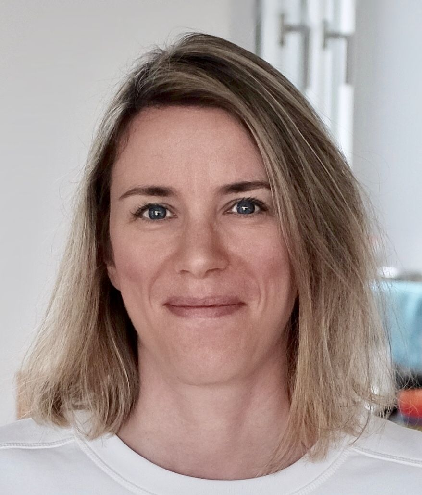
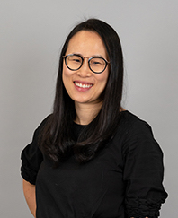

<h1 style="color:black;">3DGV: Seminar on 3D Geometry & Vision</h1>
3DGV is a virtual seminar series on Geometry Processing and 3D Computer Vision. Seminars take place every Wednesday, cycling through three different time zones (Europe, America, and Asia). We show seminar hours in six different time zones in the following table. Please <a href="https://calendar.google.com/calendar/ical/3dgv.seminar%40gmail.com/public/basic.ics">add this to your calendar</a> to know hours in your time-zone.

<!--
How to register for zoom and etc. here.
<a href="join_by_zoom.html" class="button3">Join by Zoom</a>
-->
<a href="join_youtube.html" class="button3">Join Youtube</a>

<h2 style="color:black;">Upcoming Talks</h2>
<table>
  <tbody>
    <tr valign="middle" style="background-color:#e2e2df">
      <td style="width:25%;"></td>
      <td style="width:40%;">
        <table>
          <tbody>
            <tr style="background-color:#c6def1"><td>Sydney</td>  <td>09/02 20:00 Wed</td></tr>
            <tr style="background-color:#c6def1"><td>Beijing</td> <td>09/02 18:00 Wed</td></tr>
            <tr style="background-color:#e2e2df"><td>France</td>  <td>09/02 12:00 Wed</td></tr>
            <tr style="background-color:#e2e2df"><td>UK</td>      <td>09/02 11:00 Wed</td></tr>
            <tr style="background-color:#e2cfc4"><td>Eastern</td> <td>09/02 06:00 Wed</td></tr>
            <tr style="background-color:#e2cfc4"><td>Pacific</td> <td>09/02 03:00 Wed</td></tr>
          </tbody>
        </table>
      </td>
      <td style="width:35%;"><b>Talk title</b>  Marc Pollefeys ETH Zurich & Microsoft</td>
    </tr>
    <tr valign="middle" style="background-color:#e2cfc4">
      <td></td>
      <td>
        <table>
          <tbody>
            <tr style="background-color:#c6def1"><td>Sydney</td>  <td>09/10 04:00 Thu</td></tr>
            <tr style="background-color:#c6def1"><td>Beijing</td> <td>09/10 02:00 Thu</td></tr>
            <tr style="background-color:#e2e2df"><td>France</td>  <td>09/09 20:00 Wed</td></tr>
            <tr style="background-color:#e2e2df"><td>UK</td>      <td>09/09 19:00 Wed</td></tr>
            <tr style="background-color:#e2cfc4"><td>Eastern</td> <td>09/09 14:00 Wed</td></tr>
            <tr style="background-color:#e2cfc4"><td>Pacific</td> <td>09/09 11:00 Wed</td></tr>
          </tbody>
        </table>
      </td>
      <td><b>Talk title</b>  Katerina Fragkiadaki Carnegie Mellon University</td>
    </tr>
    <tr valign="middle" style="background-color:#c6def1">
      <td></td>
      <td>
        <table>
          <tbody>
            <tr style="background-color:#c6def1"><td>Sydney</td>  <td>09/16 12:00 Wed</td></tr>
            <tr style="background-color:#c6def1"><td>Beijing</td> <td>09/16 10:00 Wed</td></tr>
            <tr style="background-color:#e2e2df"><td>France</td>  <td>09/16 04:00 Wed</td></tr>
            <tr style="background-color:#e2e2df"><td>UK</td>      <td>09/16 03:00 Wed</td></tr>
            <tr style="background-color:#e2cfc4"><td>Eastern</td> <td>09/15 22:00 Tue</td></tr>
            <tr style="background-color:#e2cfc4"><td>Pacific</td> <td>09/15 19:00 Tue</td></tr>
          </tbody>
        </table>
      </td>
      <td><b>Learning the space of 3D shapes: some challenges and our explorations</b>  Xin Tong Microsoft Research Asia</td>
    </tr>
    <tr valign="middle" style="background-color:#e2e2df">
      <td></td>
      <td>
        <table>
          <tbody>
            <tr style="background-color:#c6def1"><td>Sydney</td>  <td>09/23 20:00 Wed</td></tr>
            <tr style="background-color:#c6def1"><td>Beijing</td> <td>09/23 18:00 Wed</td></tr>
            <tr style="background-color:#e2e2df"><td>France</td>  <td>09/23 12:00 Wed</td></tr>
            <tr style="background-color:#e2e2df"><td>UK</td>      <td>09/23 11:00 Wed</td></tr>
            <tr style="background-color:#e2cfc4"><td>Eastern</td> <td>09/23 06:00 Wed</td></tr>
            <tr style="background-color:#e2cfc4"><td>Pacific</td> <td>09/23 03:00 Wed</td></tr>
          </tbody>
        </table>
      </td>
      <td><b>Talk title</b>  Michael Bronstein Imperial College London & University of Lugano & Twitter</td>
    </tr>
    <tr valign="middle" style="background-color:#e2cfc4">
      <td></td>
      <td>
        <table>
          <tbody>
            <tr style="background-color:#c6def1"><td>Sydney</td>  <td>10/01 04:00 Thu</td></tr>
            <tr style="background-color:#c6def1"><td>Beijing</td> <td>10/01 02:00 Thu</td></tr>
            <tr style="background-color:#e2e2df"><td>France</td>  <td>09/30 20:00 Wed</td></tr>
            <tr style="background-color:#e2e2df"><td>UK</td>      <td>09/30 19:00 Wed</td></tr>
            <tr style="background-color:#e2cfc4"><td>Eastern</td> <td>09/30 14:00 Wed</td></tr>
            <tr style="background-color:#e2cfc4"><td>Pacific</td> <td>09/30 11:00 Wed</td></tr>
          </tbody>
        </table>
      </td>
      <td><b>Talk title</b>  Tom Funkhouser Google</td>
    </tr>
    <tr valign="middle" style="background-color:#c6def1">
      <td></td>
      <td>
        <table border="0" cellpadding="0" cellspacing="0">
          <tbody>
            <tr style="background-color:#c6def1"><td>Sydney</td>  <td>10/07 13:00 Wed</td></tr>
            <tr style="background-color:#c6def1"><td>Beijing</td> <td>10/07 10:00 Wed</td></tr>
            <tr style="background-color:#e2e2df"><td>France</td>  <td>10/07 04:00 Wed</td></tr>
            <tr style="background-color:#e2e2df"><td>UK</td>      <td>10/07 03:00 Wed</td></tr>
            <tr style="background-color:#e2cfc4"><td>Eastern</td> <td>10/06 22:00 Tue</td></tr>
            <tr style="background-color:#e2cfc4"><td>Pacific</td> <td>10/06 19:00 Tue</td></tr>
          </tbody>
        </table>
      </td>
      <td><b>Non-strongly supervised learning for 3D Vision</b>  Gim Hee Lee National University of Singapore</td>
    </tr>
    <tr valign="middle" style="background-color:#e2e2df">
      <td><!----></td>
      <td>
        <table border="0" cellpadding="0" cellspacing="0">
          <tbody>
            <tr style="background-color:#c6def1"><td>Sydney</td>  <td>10/14 21:00 Wed</td></tr>
            <tr style="background-color:#c6def1"><td>Beijing</td> <td>10/14 18:00 Wed</td></tr>
            <tr style="background-color:#e2e2df"><td>France</td>  <td>10/14 12:00 Wed</td></tr>
            <tr style="background-color:#e2e2df"><td>UK</td>      <td>10/14 11:00 Wed</td></tr>
            <tr style="background-color:#e2cfc4"><td>Eastern</td> <td>10/14 06:00 Wed</td></tr>
            <tr style="background-color:#e2cfc4"><td>Pacific</td> <td>10/14 03:00 Wed</td></tr>
          </tbody>
        </table>
      </td>
      <td><b>Talk title</b>  Name Affiliation</td>
    </tr>
    <tr valign="middle" style="background-color:#e2cfc4">
      <td></td>
      <td>
        <table border="0" cellpadding="0" cellspacing="0">
          <tbody>
            <tr style="background-color:#c6def1"><td>Sydney</td>  <td>10/22 05:00 Thu</td></tr>
            <tr style="background-color:#c6def1"><td>Beijing</td> <td>10/22 02:00 Thu</td></tr>
            <tr style="background-color:#e2e2df"><td>France</td>  <td>10/21 20:00 Wed</td></tr>
            <tr style="background-color:#e2e2df"><td>UK</td>      <td>10/21 19:00 Wed</td></tr>
            <tr style="background-color:#e2cfc4"><td>Eastern</td> <td>10/21 14:00 Wed</td></tr>
            <tr style="background-color:#e2cfc4"><td>Pacific</td> <td>10/21 11:00 Wed</td></tr>
          </tbody>
        </table>
      </td>
      <td><b>Talk title</b>  Georgia Gkioxari Facebook AI Research</td>
    </tr>
    <tr valign="middle" style="background-color:#c6def1">
      <td></td>
      <td>
        <table border="0" cellpadding="0" cellspacing="0">
          <tbody>
            <tr style="background-color:#c6def1"><td>Sydney</td>  <td>10/28 13:00 Wed</td></tr>
            <tr style="background-color:#c6def1"><td>Beijing</td> <td>10/28 10:00 Wed</td></tr>
            <tr style="background-color:#e2e2df"><td>France</td>  <td>10/28 03:00 Wed</td></tr>
            <tr style="background-color:#e2e2df"><td>UK</td>      <td>10/28 02:00 Wed</td></tr>
            <tr style="background-color:#e2cfc4"><td>Eastern</td> <td>10/27 22:00 Tue</td></tr>
            <tr style="background-color:#e2cfc4"><td>Pacific</td> <td>10/27 19:00 Tue</td></tr>
          </tbody>
        </table>
      </td>
      <td><b>Talk title</b>  Jiajun Wu Stanford University</td>
    </tr>
    <tr valign="middle" style="background-color:#e2e2df">
      <td></td>
      <td>
        <table border="0" cellpadding="0" cellspacing="0">
          <tbody>
            <tr style="background-color:#c6def1"><td>Sydney</td>  <td>11/03 22:00 Tue</td></tr>
            <tr style="background-color:#c6def1"><td>Beijing</td> <td>11/03 19:00 Tue</td></tr>
            <tr style="background-color:#e2e2df"><td>France</td>  <td>11/03 12:00 Tue</td></tr>
            <tr style="background-color:#e2e2df"><td>UK</td>      <td>11/03 11:00 Tue</td></tr>
            <tr style="background-color:#e2cfc4"><td>Eastern</td> <td>11/03 06:00 Tue</td></tr>
            <tr style="background-color:#e2cfc4"><td>Pacific</td> <td>11/03 03:00 Tue</td></tr>
          </tbody>
        </table>
      </td>
      <td>Tuesday instead of Wednesday <b>Talk title</b>  Olga Sorkine-Hornung ETH Zurich</td>
    </tr>
    <tr valign="middle" style="bafckground-color:white">
      <td></td>
      <td></td>
      <td></td>
    </tr>   
    <tr valign="middle" style="background-color:#e2cfc4">
      <td></td>
      <td>
        <table border="0" cellpadding="0" cellspacing="0">
          <tbody>
            <tr style="background-color:#c6def1"><td>Sydney</td>  <td>11/19 06:00 Thu</td></tr>
            <tr style="background-color:#c6def1"><td>Beijing</td> <td>11/19 03:00 Thu</td></tr>
            <tr style="background-color:#e2e2df"><td>France</td>  <td>11/18 20:00 Wed</td></tr>
            <tr style="background-color:#e2e2df"><td>UK</td>      <td>11/18 19:00 Wed</td></tr>
            <tr style="background-color:#e2cfc4"><td>Eastern</td> <td>11/18 14:00 Wed</td></tr>
            <tr style="background-color:#e2cfc4"><td>Pacific</td> <td>11/18 11:00 Wed</td></tr>
          </tbody>
        </table>
      </td>
      <td><b>Talk title</b>  Name Affiliation</td>
    </tr>
    <tr valign="middle" style="background-color:#c6def1">
      <td></td>
      <td>
        <table border="0" cellpadding="0" cellspacing="0">
          <tbody>
            <tr style="background-color:#c6def1"><td>Sydney</td>  <td>11/25 13:00 Wed</td></tr>
            <tr style="background-color:#c6def1"><td>Beijing</td> <td>11/25 10:00 Wed</td></tr>
            <tr style="background-color:#e2e2df"><td>France</td>  <td>11/25 03:00 Wed</td></tr>
            <tr style="background-color:#e2e2df"><td>UK</td>      <td>11/25 02:00 Wed</td></tr>
            <tr style="background-color:#e2cfc4"><td>Eastern</td> <td>11/24 21:00 Tue</td></tr>
            <tr style="background-color:#e2cfc4"><td>Pacific</td> <td>11/24 18:00 Tue</td></tr>
          </tbody>
        </table>
      </td>
      <td><b>Reconstructing Transparent Objects</b>  Hui Huang Shenzhen University</td>
    </tr>
    <tr valign="middle" style="background-color:#e2e2df">
      <td></td>
      <td>
        <table border="0" cellpadding="0" cellspacing="0">
          <tbody>
            <tr style="background-color:#c6def1"><td>Sydney</td>  <td>12/02 22:00 Wed</td></tr>
            <tr style="background-color:#c6def1"><td>Beijing</td> <td>12/02 19:00 Wed</td></tr>
            <tr style="background-color:#e2e2df"><td>France</td>  <td>12/02 12:00 Wed</td></tr>
            <tr style="background-color:#e2e2df"><td>UK</td>      <td>12/02 11:00 Wed</td></tr>
            <tr style="background-color:#e2cfc4"><td>Eastern</td> <td>12/02 06:00 Wed</td></tr>
            <tr style="background-color:#e2cfc4"><td>Pacific</td> <td>12/02 03:00 Wed</td></tr>
          </tbody>
        </table>
      </td>
      <td><b>Talk title</b>  Andrew Davison Imperial College London</td>
    </tr>
    <tr valign="middle" style="background-color:white">
      <td></td>
      <td></td>
      <td></td>
    </tr>
    <tr valign="middle" style="background-color:#e2cfc4">
      <td></td>
      <td>
        <table border="0" cellpadding="0" cellspacing="0">
          <tbody>
            <tr style="background-color:#c6def1"><td>Sydney</td>  <td>12/17 06:00 Thu</td></tr>
            <tr style="background-color:#c6def1"><td>Beijing</td> <td>12/17 03:00 Thu</td></tr>
            <tr style="background-color:#e2e2df"><td>France</td>  <td>12/16 20:00 Wed</td></tr>
            <tr style="background-color:#e2e2df"><td>UK</td>      <td>12/16 19:00 Wed</td></tr>
            <tr style="background-color:#e2cfc4"><td>Eastern</td> <td>12/16 14:00 Wed</td></tr>
            <tr style="background-color:#e2cfc4"><td>Pacific</td> <td>12/16 11:00 Wed</td></tr>
          </tbody>
        </table>
      </td>
      <td><b>Talk title</b>  David Fouhey University of Michigan</td>
    </tr>
  </tbody>
</table>

<h2 style="color:black;">Past Talks</h2>

<h2 style="color:black;">Calendar</h2>
<iframe src="https://calendar.google.com/calendar/embed?src=3dgv.seminar%40gmail.com&ctz=America%2FVancouver" style="border: 0" width="800" height="600" frameborder="0" scrolling="no"></iframe>

<h2 style="color:black;">Organizers</h2>
<table border="0" cellpading="0" cellspacing="0">
  <tbody>
    <tr>
      <td><a href="https://www.3dunderstanding.org/"> TUM Angela Dai</a></td>
      <td><a href="https://www.comp.nus.edu.sg/cs/bio/ayao/"> NUS Angela Yao</a></td>
      <td><a href="https://people.eecs.berkeley.edu/~kanazawa/"> Berkeley Angjoo Kanazawa</a></td>
      <td><a href="http://staff.ustc.edu.cn/~juyong/"> USTC Juyong Zhang</a></td>
    </tr>
    <tr>
      <td><a href="https://www.cs.utexas.edu/~huangqx/"> UT Austin Qixing Huang</a></td>
      <td><a href="https://scholar.google.com/citations?user=jzx6_ZIAAAAJ&hl=en"> CIIRC, CVUT Torsten Sattler</a></td>
      <td><a href="https://www.cs.sfu.ca/~furukawa"> SFU Yasutaka Furukawa</a></td>
    </tr>
  </tbody>
</table>        

<h2 style="color:black;">Senior Supervisors</h2>
<table border="0" cellpading="0" cellspacing="0">
  <tbody>
    <tr>
      <td><a href="https://cfcs.pku.edu.cn/baoquan/"> Peking University Baoquan Chen</a></td>
      <td><a href="https://cs.gmu.edu/~kosecka/"> GMU Jana Košecká</a></td>
      <td><a href="https://people.eecs.berkeley.edu/~malik/"> Berkeley Jitendra Malik</a></td>
      <td><a href="https://geometry.stanford.edu/member/guibas/"> Stanford Leo Guibas</a></td>
    </tr>
    <tr>
      <td><a href="http://www0.cs.ucl.ac.uk/staff/L.Agapito/"> UCL Lourdes Agapito</a></td>
      <td><a href="https://ps.is.mpg.de/~black"> MPI Michael Black</a></td>
      <td><a href="http://users.cecs.anu.edu.au/~hartley/"> ANU Richard Hartley</a></td>
    </tr>
  </tbody>
</table>

<iframe src="https://docs.google.com/forms/d/e/1FAIpQLScaSLm3y0prj-PRM5htvsZ3R-6fUuTI3acBwAjSB0VisdzMFQ/viewform?embedded=true" width="640" height="407" frameborder="0" marginheight="0" marginwidth="0">Loading…</iframe>
