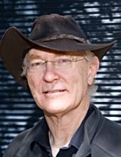

<table>
  <tbody>
    <tr valign="middle">
      <td style="width:40%;"></td>
      <td style="width:60%;">3DGV is a virtual seminar series on Geometry Processing and 3D Computer Vision. Seminars take place every Wednesday, cycling through three different time zones (Europe, America, and Asia). We show seminar hours in six different time zones in the following table. Please <a href="https://calendar.google.com/calendar/ical/3dgv.seminar%40gmail.com/public/basic.ics">add this to your calendar</a> to know hours in your time-zone.
</td>
    </tr>
  </tbody>
</table>

<!--
<h1 style="color:black;">3DGV: Seminar on 3D Geometry & Vision</h1>
3DGV is a virtual seminar series on Geometry Processing and 3D Computer Vision. Seminars take place every Wednesday, cycling through three different time zones (Europe, America, and Asia). We show seminar hours in six different time zones in the following table. Please <a href="https://calendar.google.com/calendar/ical/3dgv.seminar%40gmail.com/public/basic.ics">add this to your calendar</a> to know hours in your time-zone.
-->

<!--
How to register for zoom and etc. here.
<a href="join_by_zoom.html" class="button3">Join by Zoom</a>
-->

<a href="https://youtu.be/OXc25WXFIE0" class="button3">Join Youtube Live</a>
<!--  <a href="" class="button3">Youtube link will be available here right before the seminar start.</a>-->

<!--
<h2 style="color:black;">Talks</h2>
-->
<table cellpadding="0" cellspacing="0">
  <tbody>
    <tr valign="middle" style="background-color:#e2e2df">
      <td style="width:25%;"></td>
      <td style="width:40%;">
        <table>
          <tbody>
            <tr style="background-color:#c6def1"><td>Sydney</td>  <td>09/02 20:00 Wed</td></tr>
            <tr style="background-color:#c6def1"><td>Beijing</td> <td>09/02 18:00 Wed</td></tr>
            <tr style="background-color:#e2e2df"><td>France</td>  <td>09/02 12:00 Wed</td></tr>
            <tr style="background-color:#e2e2df"><td>UK</td>      <td>09/02 11:00 Wed</td></tr>
            <tr style="background-color:#e2cfc4"><td>Eastern</td> <td>09/02 06:00 Wed</td></tr>
            <tr style="background-color:#e2cfc4"><td>Pacific</td> <td>09/02 03:00 Wed</td></tr>
          </tbody>
        </table>
      </td>
      <td style="width:35%;">
      <b>Title</b>  <a href="">Name Affiliation</a>
      </td>
    </tr>
    <tr valign="middle" style="background-color:#e2cfc4">
      <td> 
        [ Panelists ]  
        <a href="">Name</a> (Affiliation) 
        <a href="">Name</a> (Affiliation)
        </td>
      <td style="width:40%;">
        <table>
          <tbody>
            <tr style="background-color:#c6def1"><td>Sydney</td>  <td>09/10 04:00 Thu</td></tr>
            <tr style="background-color:#c6def1"><td>Beijing</td> <td>09/10 02:00 Thu</td></tr>
            <tr style="background-color:#e2e2df"><td>France</td>  <td>09/09 20:00 Wed</td></tr>
            <tr style="background-color:#e2e2df"><td>UK</td>      <td>09/09 19:00 Wed</td></tr>
            <tr style="background-color:#e2cfc4"><td>Eastern</td> <td>09/09 14:00 Wed</td></tr>
            <tr style="background-color:#e2cfc4"><td>Pacific</td> <td>09/09 11:00 Wed</td></tr>
          </tbody>
        </table>
      </td>
      <td style="width:35%;"><b>Title</b>  <a href="">Name Affiliation</a>  Panelists: <a href="">Name (Affiliation)</a> and <a href="">Name (Affiliation)</a></td>
    </tr>
    <tr valign="middle" style="background-color:#c6def1">
      <td style> 
        [ Panelists ]  
        <a href="">Name (Affiliation)</a> 
        <a href="">Name (Affiliation)</a>
      </td>
      <td style="width:40%;">
        <table>
          <tbody>
            <tr style="background-color:#c6def1"><td>Sydney</td>  <td>09/16 12:00 Wed</td></tr>
            <tr style="background-color:#c6def1"><td>Beijing</td> <td>09/16 10:00 Wed</td></tr>
            <tr style="backgrond-color:#e2e2df"><td>France</td>   <td>09/16 04:00 Wed</td></tr>
            <tr style="background-color:#e2e2df"><td>UK</td>      <td>09/16 03:00 Wed</td></tr>
            <tr style="background-color:#e2cfc4"><td>Eastern</td> <td>09/15 22:00 Tue</td></tr>
            <tr style="background-color:#e2cfc4"><td>Pacific</td> <td>09/15 19:00 Tue</td></tr>
          </tbody>
        </table>
      </td>
      <td style="width:35%;"><b>Title</b>  <a href="">Name Affiliation</a>  Panelists: <a href="">Name (Affiliation)</a> and <a href="">Name (Affiliation)</a></td>
    </tr>
  </tbody>
</table>
 

<h2 style="color:black;">Past talks</h2>
<table cellpadding="0" cellspacing="0">
  <tbody>
    <tr valign="middle" style="background-color:#e2e2df">
      <td style="width:25%;"></td>
      <td colspan="2">
        <iframe width="560" height="315" src="https://www.youtube.com/embed/eS-BMGIVp2o" frameborder="0" allow="accelerometer; autoplay; encrypted-media; gyroscope; picture-in-picture" allowfullscreen></iframe>
      </td>
<!--
      <td style="width:40%;">
        <table>
          <tbody>
            <tr style="background-color:#c6def1"><td>Sydney</td>  <td>09/02 20:00 Wed</td></tr>
            <tr style="background-color:#c6def1"><td>Beijing</td> <td>09/02 18:00 Wed</td></tr>
            <tr style="background-color:#e2e2df"><td>France</td>  <td>09/02 12:00 Wed</td></tr>
            <tr style="background-color:#e2e2df"><td>UK</td>      <td>09/02 11:00 Wed</td></tr>
            <tr style="background-color:#e2cfc4"><td>Eastern</td> <td>09/02 06:00 Wed</td></tr>
            <tr style="background-color:#e2cfc4"><td>Pacific</td> <td>09/02 03:00 Wed</td></tr>
          </tbody>
        </table>
      </td>
      <td style="width:35%;">
      <b>3D Geometric Vision</b>  <a href="https://people.inf.ethz.ch/pomarc/">Marc Pollefeys ETH Zurich & Microsoft</a>
      </td>
-->
    </tr>
    <tr valign="middle" style="background-color:#e2cfc4">
      <td> 
        [ Panelists ]  
        <a href="http://saurabhg.web.illinois.edu/">Saurabh Gupta</a> (UIUC) 
        <a href="https://www.cs.utexas.edu/~yukez/">Yuke Zhu</a> (UT-Austin)
        </td>
      <td colspan="2">
        <iframe width="560" height="315" src="https://www.youtube.com/embed/3UZMNkJthR0" frameborder="0" allow="accelerometer; autoplay; encrypted-media; gyroscope; picture-in-picture" allowfullscreen></iframe>
      </td>
      <!--
      <td style="width:40%;">
        <table>
          <tbody>
            <tr style="background-color:#c6def1"><td>Sydney</td>  <td>09/10 04:00 Thu</td></tr>
            <tr style="background-color:#c6def1"><td>Beijing</td> <td>09/10 02:00 Thu</td></tr>
            <tr style="background-color:#e2e2df"><td>France</td>  <td>09/09 20:00 Wed</td></tr>
            <tr style="background-color:#e2e2df"><td>UK</td>      <td>09/09 19:00 Wed</td></tr>
            <tr style="background-color:#e2cfc4"><td>Eastern</td> <td>09/09 14:00 Wed</td></tr>
            <tr style="background-color:#e2cfc4"><td>Pacific</td> <td>09/09 11:00 Wed</td></tr>
          </tbody>
        </table>
      </td>
      <td style="width:35%;"><b>3D Vision with 3D View-Predictive Neural Scene representations</b>  <a href="https://www.cs.cmu.edu/~katef/">Katerina Fragkiadaki Carnegie Mellon University</a>  Panelists: <a href="http://saurabhg.web.illinois.edu/">Saurabh Gupta (UIUC)</a> and <a href="https://www.cs.utexas.edu/~yukez/">Yuke Zhu (UT-Austin)</a></td>
-->
    </tr>
    <tr valign="middle" style="background-color:#c6def1">
      <td style> 
        [ Panelists ]  
        <a href="https://cseweb.ucsd.edu/~haosu/">Hao Su (UCSD)</a> 
        <a href="http://www.cad.zju.edu.cn/home/xzhou/">Xiaowei Zhou (Zhejiang)</a>
      </td>
      <td colspan="2">
        <iframe width="560" height="315" src="https://www.youtube.com/embed/KqBcbaRh2HQ" frameborder="0" allow="accelerometer; autoplay; encrypted-media; gyroscope; picture-in-picture" allowfullscreen></iframe>
      </td>
      <!--      
      <td style="width:40%;">
        <table>
          <tbody>
            <tr style="background-color:#c6def1"><td>Sydney</td>  <td>09/16 12:00 Wed</td></tr>
            <tr style="background-color:#c6def1"><td>Beijing</td> <td>09/16 10:00 Wed</td></tr>
            <tr style="backgrond-color:#e2e2df"><td>France</td>   <td>09/16 04:00 Wed</td></tr>
            <tr style="background-color:#e2e2df"><td>UK</td>      <td>09/16 03:00 Wed</td></tr>
            <tr style="background-color:#e2cfc4"><td>Eastern</td> <td>09/15 22:00 Tue</td></tr>
            <tr style="background-color:#e2cfc4"><td>Pacific</td> <td>09/15 19:00 Tue</td></tr>
          </tbody>
        </table>
      </td>
      <td style="width:35%;"><b>Learning the space of 3D shapes: some challenges and our explorations</b>  <a href="http://www.xtong.info/">Xin Tong Microsoft Research Asia</a>  Panelists: <a href="https://cseweb.ucsd.edu/~haosu/">Hao Su (UCSD)</a> and <a href="http://www.cad.zju.edu.cn/home/xzhou/">Xiaowei Zhou (Zhejiang)</a></td>
       -->
    </tr>
    <tr valign="middle" style="background-color:#e2e2df">
      <td> 
      [ Panelists ]  
        <a href="http://virtualhumans.mpi-inf.mpg.de/">Gerard Pons-Moll (MPI)</a> 
        <a href="http://www.lix.polytechnique.fr/~maks/">Maks Ovsjanikov (Ecole Polytechnique)</a>
      </td>
      <td colspan="2">
        <iframe width="560" height="315" src="https://www.youtube.com/embed/2Z4L2I59AKo" frameborder="0" allow="accelerometer; autoplay; encrypted-media; gyroscope; picture-in-picture" allowfullscreen></iframe>
      </td>
      <!--
      <td style="width:40%;">
        <table>
          <tbody>
            <tr style="background-color:#c6def1"><td>Sydney</td>  <td>09/23 20:00 Wed</td></tr>
            <tr style="background-color:#c6def1"><td>Beijing</td> <td>09/23 18:00 Wed</td></tr>
            <tr style="background-color:#e2e2df"><td>France</td>  <td>09/23 12:00 Wed</td></tr>
            <tr style="background-color:#e2e2df"><td>UK</td>      <td>09/23 11:00 Wed</td></tr>
            <tr style="background-color:#e2cfc4"><td>Eastern</td> <td>09/23 06:00 Wed</td></tr>
            <tr style="background-color:#e2cfc4"><td>Pacific</td> <td>09/23 03:00 Wed</td></tr>
          </tbody>
        </table>
      </td>
      <td style="width:35%;"><b>Geometric Deep Learning for 3D Shape Analysis and Synthesis</b>  <a href="https://www.imperial.ac.uk/people/m.bronstein">Michael Bronstein Imperial College London & University of Lugano & Twitter</a>  
        Panelists: <a href="http://virtualhumans.mpi-inf.mpg.de/">Gerard Pons-Moll (MPI)</a> and <a href="http://www.lix.polytechnique.fr/~maks/">Maks Ovsjanikov (Ecole Polytechnique)</a></td>
-->
    </tr> 
    <tr valign="middle" style="background-color:#e2cfc4">
      <td>  
      [ Panelists ] <a href="http://web.stanford.edu/~gordonwz/">Gordon Wetzstein (Stanford)</a> 
        <a href="https://www2.cs.sfu.ca/~haoz/">Richard Zhang (SFU)</a>
      </td>
      <td colspan="2">
        <iframe width="560" height="315" src="https://www.youtube.com/embed/-C9_KggRJ-g" frameborder="0" allow="accelerometer; autoplay; encrypted-media; gyroscope; picture-in-picture" allowfullscreen></iframe>
      </td>
      <!--
      <td style="width:40%;">
        <table>
          <tbody>
            <tr style="background-color:#c6def1"><td>Sydney</td>  <td>10/01 04:00 Thu</td></tr>
            <tr style="background-color:#c6def1"><td>Beijing</td> <td>10/01 02:00 Thu</td></tr>
            <tr style="background-color:#e2e2df"><td>France</td>  <td>09/30 20:00 Wed</td></tr>
            <tr style="background-color:#e2e2df"><td>UK</td>      <td>09/30 19:00 Wed</td></tr>
            <tr style="background-color:#e2cfc4"><td>Eastern</td> <td>09/30 14:00 Wed</td></tr>
            <tr style="background-color:#e2cfc4"><td>Pacific</td> <td>09/30 11:00 Wed</td></tr>
          </tbody>
        </table>
      </td>
      <td style="width:35%;"><b>Learning Implicit 3D Shape Representations</b>  <a href="https://www.cs.princeton.edu/~funk/">Tom Funkhouser Google</a>  
      [ Panelists ] <a href="http://web.stanford.edu/~gordonwz/">Gordon Wetzstein (Stanford)</a> <a href="https://www2.cs.sfu.ca/~haoz/">Richard Zhang (SFU)</a>
      </td>
      -->
    </tr>
    <tr valign="middle" style="background-color:#e2cfc4">
      <td>
      </td>
      <td colspan="2">
        <iframe width="560" height="315" src="https://www.youtube.com/embed/Pp63AodqEBw" frameborder="0" allow="accelerometer; autoplay; encrypted-media; gyroscope; picture-in-picture" allowfullscreen></iframe>
      </td>
    <!--   
    <tr valign="middle" style="background-color:#c6def1">
      <td></td>
      <td style="width:40%;">
        <table border="0" cellpadding="0" cellspacing="0">
          <tbody>
            <tr style="background-color:#c6def1"><td>Sydney</td>  <td>10/07 13:00 Wed</td></tr>
            <tr style="background-color:#c6def1"><td>Beijing</td> <td>10/07 10:00 Wed</td></tr>
            <tr style="background-color:#e2e2df"><td>France</td>  <td>10/07 04:00 Wed</td></tr>
            <tr style="background-color:#e2e2df"><td>UK</td>      <td>10/07 03:00 Wed</td></tr>
            <tr style="background-color:#e2cfc4"><td>Eastern</td> <td>10/06 22:00 Tue</td></tr>
            <tr style="background-color:#e2cfc4"><td>Pacific</td> <td>10/06 19:00 Tue</td></tr>
          </tbody>
        </table>
      </td>
      <td style="width:35%;"><b>Non-strongly supervised learning for 3D Vision</b>  <a href="https://www.comp.nus.edu.sg/~leegh/">Gim Hee Lee National University of Singapore</a></td>
    -->
    </tr>
    <tr valign="middle" style="background-color:#e2e2df">
      <td>  
      [ Panelists ] <a href="http://www.cvlibs.net/">Andreas Geiger (Tübingen/MPI)</a> <a href="https://kevinkaixu.net/">Kevin Xu (NUDT)</a>
      </td>
      <td colspan="2">
        <iframe width="560" height="315" src="https://www.youtube.com/embed/uJAjduVtaQ4" frameborder="0" allow="accelerometer; autoplay; encrypted-media; gyroscope; picture-in-picture" allowfullscreen></iframe>
      </td>     
      <!--
      <td style="width:40%;">
        <table border="0" cellpadding="0" cellspacing="0">
          <tbody>
            <tr style="background-color:#c6def1"><td>Sydney</td>  <td>10/14 21:00 Wed</td></tr>
            <tr style="background-color:#c6def1"><td>Beijing</td> <td>10/14 18:00 Wed</td></tr>
            <tr style="background-color:#e2e2df"><td>France</td>  <td>10/14 12:00 Wed</td></tr>
            <tr style="background-color:#e2e2df"><td>UK</td>      <td>10/14 11:00 Wed</td></tr>
            <tr style="background-color:#e2cfc4"><td>Eastern</td> <td>10/14 06:00 Wed</td></tr>
            <tr style="background-color:#e2cfc4"><td>Pacific</td> <td>10/14 03:00 Wed</td></tr>
          </tbody>
        </table>
      </td>
      <td style="width:35%;"><b>Deep 3D Generative Modeling</b>  <a href="http://www0.cs.ucl.ac.uk/staff/n.mitra/">Niloy Mitra University College London & Adobe Research</a>  
           [ Panelists ] <a href="http://www.cvlibs.net/">Andreas Geiger (Tübingen/MPI)</a> <a href="https://kevinkaixu.net/">Kevin Xu (NUDT)</a>
       </td>
    -->
    </tr>
    <tr valign="middle" style="background-color:#e2cfc4">
      <td>  
      [ Panelists ] <a href="https://people.eecs.berkeley.edu/~kanazawa/">Angjoo Kanazawa (Berkeley)</a> <a href="https://orlitany.github.io/">Or Litany (NVIDIA)</a>
      </td>
      <td colspan="2">
        <iframe width="560" height="315" src="https://www.youtube.com/embed/gXLpy3jd2mQ" frameborder="0" allow="accelerometer; autoplay; encrypted-media; gyroscope; picture-in-picture" allowfullscreen></iframe>
      </td>     
      <!--
      <td style="width:40%;">
        <table border="0" cellpadding="0" cellspacing="0">
          <tbody>
            <tr style="background-color:#c6def1"><td>Sydney</td>  <td>10/22 05:00 Thu</td></tr>
            <tr style="background-color:#c6def1"><td>Beijing</td> <td>10/22 02:00 Thu</td></tr>
            <tr style="background-color:#e2e2df"><td>France</td>  <td>10/21 20:00 Wed</td></tr>
            <tr style="background-color:#e2e2df"><td>UK</td>      <td>10/21 19:00 Wed</td></tr>
            <tr style="background-color:#e2cfc4"><td>Eastern</td> <td>10/21 14:00 Wed</td></tr>
            <tr style="background-color:#e2cfc4"><td>Pacific</td> <td>10/21 11:00 Wed</td></tr>
          </tbody>
        </table>
      </td>
      <td style="width:35%;"><b>Recognizing Objects and Scenes in 3D</b>  <a href="https://gkioxari.github.io/">Georgia Gkioxari Facebook AI Research</a>  
      [ Panelists ] <a href="https://people.eecs.berkeley.edu/~kanazawa/">Angjoo Kanazawa (Berkeley)</a> <a href="https://orlitany.github.io/">Or Litany (NVIDIA)</a>
      </td>
-->
    </tr>
    <tr valign="middle" style="background-color:#c6def1">
      <td>  
      [ Panelists ] <a href="https://www.cs.columbia.edu/~shurans/">Shuran Song (Columbia)</a> <a href="https://www.cse.iitb.ac.in/~sidch/">Siddhartha Chaudhuri (Adobe Research and IIT Bombay)</a>
      </td>
      <td colspan="2">
        <iframe width="560" height="315" src="https://www.youtube.com/embed/-ltAta-No7w" frameborder="0" allow="accelerometer; autoplay; encrypted-media; gyroscope; picture-in-picture" allowfullscreen></iframe>
      </td>
      <!--
      <td style="width:40%;">
        <table>
          <tbody>
            <tr style="background-color:#c6def1"><td>Sydney</td>  <td>10/28 13:00 Wed</td></tr>
            <tr style="background-color:#c6def1"><td>Beijing</td> <td>10/28 10:00 Wed</td></tr>
            <tr style="background-color:#e2e2df"><td>France</td>  <td>10/28 03:00 Wed</td></tr>
            <tr style="background-color:#e2e2df"><td>UK</td>      <td>10/28 02:00 Wed</td></tr>
            <tr style="background-color:#e2cfc4"><td>Eastern</td> <td>10/27 22:00 Tue</td></tr>
            <tr style="background-color:#e2cfc4"><td>Pacific</td> <td>10/27 19:00 Tue</td></tr>
          </tbody>
        </table>
      </td>
      <td style="width:35%;"><b>Surfaces, Objects, Procedures: Integrating Learning and Graphics for 3D Scene Understanding</b>  <a href="https://jiajunwu.com/">Jiajun Wu Stanford University</a>  
        [ Panelists ] <a href="https://www.cs.columbia.edu/~shurans/">Shuran Song (Columbia)</a> <a href="https://www.cse.iitb.ac.in/~sidch/">Siddhartha Chaudhuri (Adobe Research and IIT Bombay)</a></td>
-->
    </tr>
    <tr valign="middle" style="background-color:#e2e2df">
      <td>  
        [ Panelists ] <a href="https://ls7-gv.cs.tu-dortmund.de/"> Mario Botsch (TU Dortmund)</a>
      </td>
     <td colspan="2">
       The recording not available.        
      </td>
      <!--
      <td style="width:40%;">
        <table>
          <tbody>
            <tr style="background-color:#c6def1"><td>Sydney</td>  <td>11/03 22:00 Tue</td></tr>
            <tr style="background-color:#c6def1"><td>Beijing</td> <td>11/03 19:00 Tue</td></tr>
            <tr style="background-color:#e2e2df"><td>France</td>  <td>11/03 12:00 Tue</td></tr>
            <tr style="background-color:#e2e2df"><td>UK</td>      <td>11/03 11:00 Tue</td></tr>
            <tr style="background-color:#e2cfc4"><td>Eastern</td> <td>11/03 06:00 Tue</td></tr>
            <tr style="background-color:#e2cfc4"><td>Pacific</td> <td>11/03 03:00 Tue</td></tr>
          </tbody>
        </table>
      </td>
      <td style="width:35%;">The recording is not available as announced. <b>Shape Deformation for 3D Modeling and Learning</b>  <a href="https://igl.ethz.ch/people/sorkine/">Olga Sorkine-Hornung ETH Zurich</a> 
        [ Panelists ] <a href="https://ls7-gv.cs.tu-dortmund.de/"> Mario Botsch (TU Dortmund)</a></td>
-->
    </tr>
    <tr valign="middle" style="bafckground-color:white">
      <td></td>
      <td></td>
      <td></td>
    </tr>   
    <tr valign="middle" style="background-color:#e2cfc4">
      <td>  
     [ Panelists ] <a href="https://people.cs.umass.edu/~kalo/">Vangelis Kalogerakis (UMASS)</a> <a href="https://dhoiem.cs.illinois.edu/">Derek Hoiem (UIUC)</a>
      </td>
     <td colspan="2">
        <iframe width="560" height="315" src="https://www.youtube.com/embed/2rIE01g9WcM" frameborder="0" allow="accelerometer; autoplay; clipboard-write; encrypted-media; gyroscope; picture-in-picture" allowfullscreen></iframe>
      </td>
      <!--
      <td style="width:40%;">
        <table border="0" cellpadding="0" cellspacing="0">
          <tbody>
            <tr style="background-color:#c6def1"><td>Sydney</td>  <td>11/19 06:00 Thu</td></tr>
            <tr style="background-color:#c6def1"><td>Beijing</td> <td>11/19 03:00 Thu</td></tr>
            <tr style="background-color:#e2e2df"><td>France</td>  <td>11/18 20:00 Wed</td></tr>
            <tr style="background-color:#e2e2df"><td>UK</td>      <td>11/18 19:00 Wed</td></tr>
            <tr style="background-color:#e2cfc4"><td>Eastern</td> <td>11/18 14:00 Wed</td></tr>
            <tr style="background-color:#e2cfc4"><td>Pacific</td> <td>11/18 11:00 Wed</td></tr>
          </tbody>
        </table>
      </td>
      <td style="width:35%;"><b>Building 3D Representations of Scenes from One Or Two Ordinary Images</b>  <a href="https://web.eecs.umich.edu/~fouhey/">David Fouhey University of Michigan</a>  
      [ Panelists ] <a href="https://people.cs.umass.edu/~kalo/">Vangelis Kalogerakis (UMASS)</a> <a href="https://dhoiem.cs.illinois.edu/">Derek Hoiem (UIUC)</a>
      </td>
      -->
    </tr>
    <tr valign="middle" style="background-color:#c6def1">
      <td>  
              [ Panelists ] <a href="http://www.cad.zju.edu.cn/home/weiweixu/weiweixu_en.htm">Weiwei Xu (Zhejiang)</a>
      </td>
      <td colspan="2">
        <iframe width="560" height="315" src="https://www.youtube.com/embed/3LwpNMRhbH4" frameborder="0" allow="accelerometer; autoplay; clipboard-write; encrypted-media; gyroscope; picture-in-picture" allowfullscreen></iframe>
      </td>
<!--
      <td style="width:40%;">
        <table border="0" cellpadding="0" cellspacing="0">
          <tbody>
            <tr style="background-color:#c6def1"><td>Sydney</td>  <td>11/25 13:00 Wed</td></tr>
            <tr style="background-color:#c6def1"><td>Beijing</td> <td>11/25 10:00 Wed</td></tr>
            <tr style="background-color:#e2e2df"><td>France</td>  <td>11/25 03:00 Wed</td></tr>
            <tr style="background-color:#e2e2df"><td>UK</td>      <td>11/25 02:00 Wed</td></tr>
            <tr style="background-color:#e2cfc4"><td>Eastern</td> <td>11/24 21:00 Tue</td></tr>
            <tr style="background-color:#e2cfc4"><td>Pacific</td> <td>11/24 18:00 Tue</td></tr>
          </tbody>
        </table>
      </td>
      <td style="width:35%;"><b>Reconstructing Transparent Objects</b>  <a href="https://vcc.tech/~huihuang">Hui Huang Shenzhen University</a>  
        [ Panelists ] <a href="http://www.cad.zju.edu.cn/home/weiweixu/weiweixu_en.htm">Weiwei Xu (Zhejiang)</a>
      </td>
-->
    </tr>
    <tr valign="middle" style="background-color:white">
      <td></td>
      <td></td>
      <td></td>
    </tr>
  <!--    
    <tr valign="middle" style="background-color:#e2e2df">
      <td></td>
      <td style="width:40%;">
        <table border="0" cellpadding="0" cellspacing="0">
          <tbody>
            <tr style="background-color:#c6def1"><td>Sydney</td>  <td>12/02 22:00 Wed</td></tr>
            <tr style="background-color:#c6def1"><td>Beijing</td> <td>12/02 19:00 Wed</td></tr>
            <tr style="background-color:#e2e2df"><td>France</td>  <td>12/02 12:00 Wed</td></tr>
            <tr style="background-color:#e2e2df"><td>UK</td>      <td>12/02 11:00 Wed</td></tr>
            <tr style="background-color:#e2cfc4"><td>Eastern</td> <td>12/02 06:00 Wed</td></tr>
            <tr style="background-color:#e2cfc4"><td>Pacific</td> <td>12/02 03:00 Wed</td></tr>
          </tbody>
        </table>
      </td>
      <td style="width:35%;"><b>Talk title</b>  <a href="https://www.doc.ic.ac.uk/~ajd/">Andrew Davison Imperial College London</a></td>
    </tr>
-->
    <tr valign="middle" style="background-color:white">
      <td></td>
      <td></td>
      <td></td>
    </tr>    
    <tr valign="middle" style="background-color:#e2cfc4">
      <td>  
      [ Panelists ] <a href="https://jiajunwu.com/">Jiajun Wu (Stanford)</a>
      </td>
      <td colspan="2">
        <iframe width="560" height="315" src="https://www.youtube.com/embed/OXc25WXFIE0" frameborder="0" allow="accelerometer; autoplay; clipboard-write; encrypted-media; gyroscope; picture-in-picture" allowfullscreen></iframe>
      </td>
      <!--    
      <td style="width:40%;">
        <table border="0" cellpadding="0" cellspacing="0">
          <tbody>
            <tr style="background-color:#c6def1"><td>Sydney</td>  <td>12/17 06:00 Thu</td></tr>
            <tr style="background-color:#c6def1"><td>Beijing</td> <td>12/17 03:00 Thu</td></tr>
            <tr style="background-color:#e2e2df"><td>France</td>  <td>12/16 20:00 Wed</td></tr>
            <tr style="background-color:#e2e2df"><td>UK</td>      <td>12/16 19:00 Wed</td></tr>
            <tr style="background-color:#e2cfc4"><td>Eastern</td> <td>12/16 14:00 Wed</td></tr>
            <tr style="background-color:#e2cfc4"><td>Pacific</td> <td>12/16 11:00 Wed</td></tr>
          </tbody>
        </table>
      </td>
      <td style="width:35%;"><b>Joint Learning over Geometric Data</b>  <a href="https://geometry.stanford.edu/member/guibas/">Leo Guibas Stanford University</a>  
        [ Panelists ] <a href="https://jiajunwu.com/">Jiajun Wu (Stanford)</a>
      </td>
-->
    </tr>
  </tbody>
</table>

<h2 style="color:black;">Calendar (time zone conversion)</h2>

<iframe src="https://calendar.google.com/calendar/embed?height=500&amp;wkst=1&amp;bgcolor=%23ffffff&amp;ctz=America%2FVancouver&amp;src=M2Rndi5zZW1pbmFyQGdtYWlsLmNvbQ&amp;color=%23039BE5&amp;showTitle=1&amp;mode=AGENDA" style="border:solid 1px #777" width="500" height="500" frameborder="0" scrolling="no"></iframe>

<h2 style="color:black;">Organizers</h2>
<table border="0" cellpading="0" cellspacing="0">
  <tbody>
    <tr>
      <td><a href="https://www.3dunderstanding.org/"> TUM Angela Dai</a></td>
      <td><a href="https://www.comp.nus.edu.sg/cs/bio/ayao/"> NUS Angela Yao</a></td>
      <td><a href="https://people.eecs.berkeley.edu/~kanazawa/"> Berkeley Angjoo Kanazawa</a></td>
    </tr>
    <tr>
      <td><a href="https://jiajunwu.com/"> Stanford Jiajun Wu</a></td>
      <td><a href="http://staff.ustc.edu.cn/~juyong/"> USTC Juyong Zhang</a></td>
      <td><a href="https://www.cs.utexas.edu/~huangqx/"> UT Austin Qixing Huang</a></td>      
    </tr>
    <tr>
      <td><a href="https://scholar.google.com/citations?user=jzx6_ZIAAAAJ&hl=en"> CIIRC, CVUT Torsten Sattler</a></td>
      <td><a href="https://xueyuhanlang.github.io/"> MSRA Yang Liu</a></td>
      <td><a href="https://www.cs.sfu.ca/~furukawa"> SFU Yasutaka Furukawa</a></td>
    </tr>
  </tbody>
</table>        

<h2 style="color:black;">Senior Supervisors</h2>
<table border="0" cellpading="0" cellspacing="0">
  <tbody>
    <tr>
      <td><a href="https://cfcs.pku.edu.cn/baoquan/"> Peking University Baoquan Chen</a></td>
      <td><a href="https://cs.gmu.edu/~kosecka/"> GMU Jana Košecká</a></td>
      <td><a href="https://people.eecs.berkeley.edu/~malik/"> Berkeley Jitendra Malik</a></td>
      <td><a href="https://geometry.stanford.edu/member/guibas/"> Stanford Leo Guibas</a></td>
    </tr>
    <tr>
      <td><a href="http://www0.cs.ucl.ac.uk/staff/L.Agapito/"> UCL Lourdes Agapito</a></td>
      <td><a href="https://ps.is.mpg.de/~black"> MPI Michael Black</a></td>
      <td><a href="http://users.cecs.anu.edu.au/~hartley/"> ANU Richard Hartley</a></td>
    </tr>
  </tbody>
</table>

<iframe src="https://docs.google.com/forms/d/e/1FAIpQLScaSLm3y0prj-PRM5htvsZ3R-6fUuTI3acBwAjSB0VisdzMFQ/viewform?embedded=true" width="640" height="407" frameborder="0" marginheight="0" marginwidth="0">Loading…</iframe>
